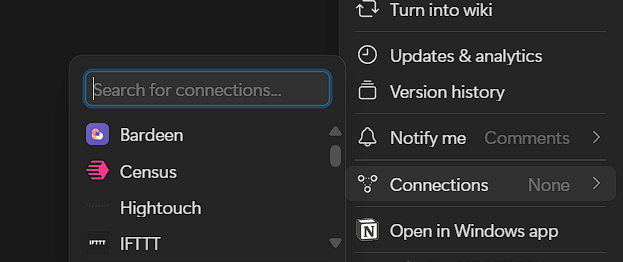

# Job Management MCP Server

A Model Control Protocol (MCP) server that provides tools for managing job listings on your local file system. This server is designed to work with Claude desktop, allowing Claude to interact with your local files through the MCP protocol. It uses Pica mcp server's
Firecrawl and Notion connections to automate the workflow of scraping the web for job descriptions and storing it.

## Flow of things:
1. Create a Pica OS account
2. Add a Firecrawl connection at `https://app.picaos.com/connections` (Prerequisite: A Firecrawl API would be required and it can be obtained for free from `https://www.firecrawl.dev/` after creating a free Firecrawl account)
3. Add a Notion connection at `https://app.picaos.com/connections` (Prerequisite: Create a free Notion account --> then create an integration at `https://www.notion.so/profile/integrations` --> then create a Notion page and add this integration as a connection)

The connection option can be found by clicking on the 3 horizontal dots on the top right and then scrolling down to the following:



## Overview

This project implements an MCP server with tools to:

- Store job listings in local text files
- Read job listings from files
- Format job listings with optional timestamps
- Makes use of Pica's Firecrawl to scrape the web for job openings and Notion connections to store the details in a notion page

## Installation

### Prerequisites

- Python 3.8 or higher
- [uv](https://github.com/astral-sh/uv) package manager
- PicaOs account

### Setup

1. Clone this repository
2. Create a virtual environment and install dependencies:

```bash
# Create virtual environment with uv
uv venv

# Activate the virtual environment (Windows)
.venv\Scripts\activate

# Activate the virtual environment (macOS/Linux)
source .venv/bin/activate

# Install requirements
uv pip install -r requirements.txt
```

## Usage

### Starting the Server

Run the MCP server:

```bash
mcp dev main.py
```

This will start the server with stdio transport, ready to communicate with Claude desktop.

### Adding to Claude Desktop

1. Add the Pica MCP server to Claude desktop by following the instructions posted at `https://docs.picaos.com/sdk/anthropic-mcp`.

1. Open Claude Desktop application
2. Go to Settings (Hamburger icon)
3. Navigate to the File --> Settings --> Developer --> Edit config
4. Open "claude_desktop_config"
5. Add the following entry to the JSON:
    ```JSON
    "pica_personal_mcp": {
      "command": "uv",
      "args": [
        "--directory",
        "C:\\Users\\path_to_your\\pica_personal_mcp",
        "run",
        "main.py"
      ]
    }
    ```
6. Close Claude desktop (make sure to close it from the background processes as well)
7. Restart Claude desktop. Click the Hammer 🔨 icon to find this MCP server amongst the installed MCP servers.

### Available Tools

The MCP server exposes three main tools:

1. **`store_jobs`**: Saves job listings to a file
   - Arguments:
     - `jobs`: List of job titles/details to store
     - `filename`: Optional custom filename (defaults to "job-log.txt")
     - `append`: Boolean to append instead of overwrite (defaults to False)

2. **`structure_jobs`**: Formats job listings
   - Arguments:
     - `jobs`: List of job titles/details to format
     - `add_timestamp`: Boolean to include timestamps (defaults to False)

3. **`get_saved_jobs`**: Retrieves previously saved job listings
   - Arguments:
     - `filename`: Optional custom filename to read from (defaults to "job-log.txt")

### Example Claude Prompts

To interact with this MCP server through Claude desktop:

- "Store these job listings: Software Engineer, Product Manager, Data Scientist by searching for them using my Pica connection with Firecrawl"
- "Format the following job listings with timestamps: Junior Developer, Senior Developer, and then store them into a page in Notion, using my Pica connection"
- "Show me all the job listings I've previously saved in Notion"

## Troubleshooting

- If Claude can't connect to your MCP server, make sure:
  - The virtual environment is properly created
  - All dependencies are installed
  - The path to your Python executable and main.py file is correct


## Requirements

The server depends on the following packages:

- mcp
- pydantic
- uvicorn
- starlette
- python-dotenv
- typing-extensions

## License

This project is for personal use.